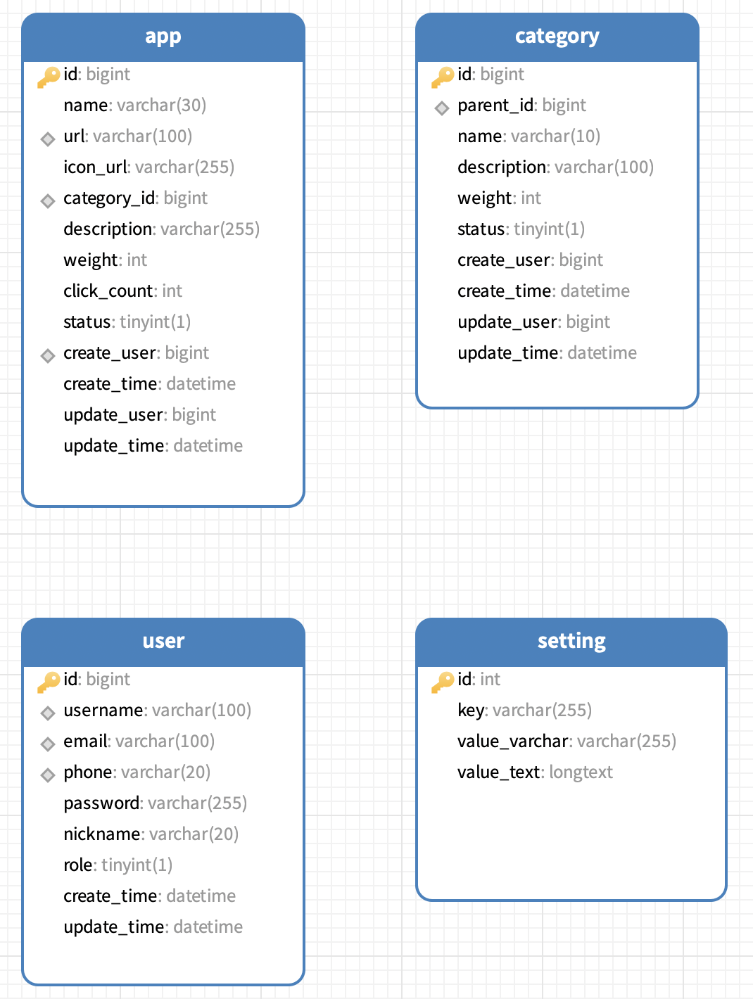

# 数据库设计

## 表模型



## 主要表

### USER 用户表

```sql
DROP TABLE IF EXISTS `user`;
CREATE TABLE `user` (
  `id` bigint unsigned NOT NULL AUTO_INCREMENT COMMENT '主键，自增ID',
  `username` varchar(100) DEFAULT NULL COMMENT '用户名',
  `email` varchar(100) DEFAULT NULL COMMENT '电子邮件',
  `phone` varchar(20) CHARACTER SET utf8mb4 COLLATE utf8mb4_0900_ai_ci DEFAULT NULL COMMENT '电话号码',
  `password` varchar(255) DEFAULT NULL COMMENT '密码',
  `nickname` varchar(20) CHARACTER SET utf8mb4 COLLATE utf8mb4_0900_ai_ci NOT NULL DEFAULT '游客' COMMENT '昵称',
  `role` tinyint(1) NOT NULL DEFAULT '0' COMMENT '角色，0表示禁用用户，1表示用户，2表示管理员',
  `create_time` datetime NOT NULL COMMENT '创建时间',
  `update_time` datetime NOT NULL COMMENT '更新时间',
  PRIMARY KEY (`id`) USING BTREE,
  UNIQUE KEY `email` (`email`) USING BTREE,
  UNIQUE KEY `username` (`username`) USING BTREE,
  UNIQUE KEY `phone` (`phone`) USING BTREE,
  CONSTRAINT `user_chk_1` CHECK ((`role` in (0,1,2)))
) ENGINE=InnoDB AUTO_INCREMENT=24 DEFAULT CHARSET=utf8mb4 COLLATE=utf8mb4_0900_ai_ci COMMENT='用户表';

```

- id: bigint 主键 唯一
- username: varchar(100) 用户名 唯一
- email: varchar(100) 邮箱 唯一
- phone: varchar(20) 手机号 唯一
- password: varchar(255) 密码
- nickname: varchar(20) 昵称
- role: tinyint(1) 0:禁用用户 1:普通用户 2:管理员
- create_time: datetime 创建时间
- update_time: datetime 更新时间

### CATEGORY分类表

```sql
DROP TABLE IF EXISTS `category`;
CREATE TABLE `category` (
  `id` bigint unsigned NOT NULL AUTO_INCREMENT COMMENT '主键，自增ID',
  `parent_id` bigint unsigned DEFAULT NULL COMMENT '父分类的ID，NULL表示没有父分类',
  `name` varchar(10) CHARACTER SET utf8mb4 COLLATE utf8mb4_0900_ai_ci NOT NULL COMMENT '分类名，唯一',
  `description` varchar(100) CHARACTER SET utf8mb4 COLLATE utf8mb4_0900_ai_ci DEFAULT NULL COMMENT '分类描述',
  `weight` int NOT NULL DEFAULT '0' COMMENT '分类权重，范围0-100，默认0',
  `status` tinyint(1) NOT NULL DEFAULT '1' COMMENT '状态：0表示禁用，1表示启用',
  `create_user` bigint unsigned NOT NULL COMMENT '创建者ID',
  `create_time` datetime NOT NULL COMMENT '创建时间',
  `update_user` bigint unsigned DEFAULT NULL COMMENT '更新者ID',
  `update_time` datetime NOT NULL COMMENT '更新时间',
  PRIMARY KEY (`id`) USING BTREE,
  KEY `category_parent_idx` (`parent_id`) USING BTREE
) ENGINE=InnoDB AUTO_INCREMENT=46 DEFAULT CHARSET=utf8mb4 COLLATE=utf8mb4_0900_ai_ci COMMENT='分类表';

```

- id: bigint 主键 唯一
- parent_id: bigint 父分类的id，默认为NULL没有父分类
- name: varchar(10) 分类名  唯一
- description: varchar(100) 分类描述
- weight: int 分类权重0-100，默认0
- status: tinyint(1) 0:禁用分类 1:启用分类
- create_user: bigint 创建者id
- create_time: datetime 创建时间
- update_user: bigint 更新者id
- update_time: datetime 更新时间

### APP 应用表

```sql
DROP TABLE IF EXISTS `app`;
CREATE TABLE `app` (
  `id` bigint unsigned NOT NULL AUTO_INCREMENT COMMENT '主键，自增ID',
  `name` varchar(30) DEFAULT NULL COMMENT '应用名',
  `url` varchar(100) CHARACTER SET utf8mb4 COLLATE utf8mb4_0900_ai_ci NOT NULL COMMENT '应用地址，唯一',
  `icon_url` varchar(255) CHARACTER SET utf8mb4 COLLATE utf8mb4_0900_ai_ci DEFAULT NULL COMMENT '图标路径',
  `category_id` bigint unsigned NOT NULL COMMENT '分类ID，逻辑外键',
  `description` varchar(255) DEFAULT NULL COMMENT '应用描述',
  `weight` int NOT NULL DEFAULT '0' COMMENT '应用权重，范围0-100，默认0',
  `click_count` int NOT NULL DEFAULT '0' COMMENT '点击量，默认0',
  `status` tinyint(1) NOT NULL DEFAULT '1' COMMENT '状态： 1:启用, 2:隐藏, 3:私有4:禁用,',
  `create_user` bigint unsigned NOT NULL COMMENT '创建者ID',
  `create_time` datetime NOT NULL COMMENT '创建时间',
  `update_user` bigint unsigned DEFAULT NULL COMMENT '更新者ID',
  `update_time` datetime NOT NULL COMMENT '更新时间',
  PRIMARY KEY (`id`) USING BTREE,
  UNIQUE KEY `url_create_user` (`url`,`create_user`),
  KEY `app_category_idx` (`category_id`) USING BTREE
) ENGINE=InnoDB AUTO_INCREMENT=80 DEFAULT CHARSET=utf8mb4 COLLATE=utf8mb4_0900_ai_ci COMMENT='应用表';

```

- id: bigint 主键  唯一
- name: varchar(30) 应用名  唯一
- url: varchar(100) 应用地址  唯一
- icon_url: varchar(255) 图标路径
- category_id: bigint 分类id 逻辑外键
- description: varchar(100) 应用描述
- weight: int 应用权重0-100，默认0
- click_count: int 点击量
- status: tinyint(1) COMMENT '0:禁用, 1:启用, 2:隐藏, 3:私有' 0:禁用应用 1:启用应用 2: 隐藏应用 3: 私有应用
- create_user: bigint 创建者id
- create_time: datetime 创建时间
- update_user: bigint 更新者id
- update_time: datetime 更新时间
