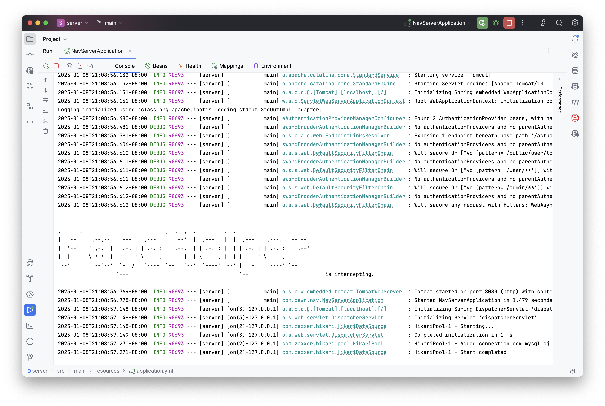
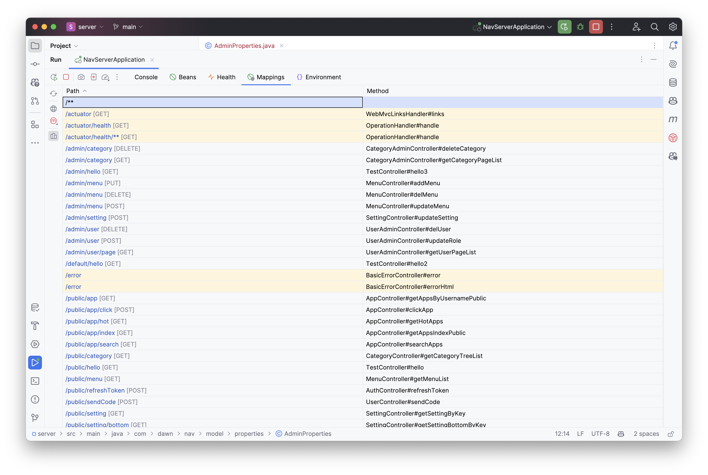
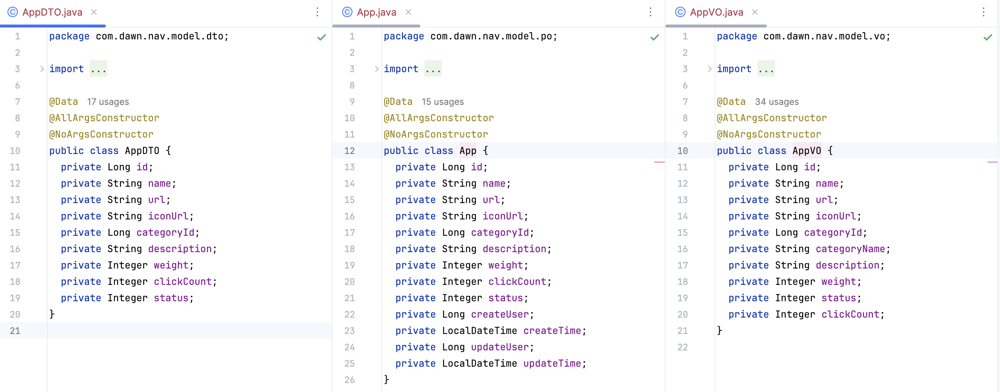

# SpringBoot+Mybatis


## 结构

### 项目结构

```java
.
├── main  // 主项目源码
│   ├── java
│   │   └── com
│   │       └── dawn
│   │           └── nav
│   │               ├── authentication   // 认证模块
│   │               │   ├── config       // SpringSecurity认证配置
│   │               │   ├── handler      // 认证处理器
│   │               │   │   ├── exception // 认证异常
│   │               │   │   └── login     // 登录方式
│   │               │   │       ├── email     // 邮箱登录
│   │               │   │       └── username  // 用户名登录
│   │               │   └── resourceApi  // 资源接口
│   │               │       ├── adminApi   // 管理端接口
│   │               │       ├── publicApi  // 公共接口
│   │               │       └── userApi    // 用户端接口
│   │               ├── exception       // 全局异常处理
│   │               ├── model           // 数据模型
│   │               │   ├── constant    // 常量定义
│   │               │   ├── dto         // 数据传输对象
│   │               │   ├── enums       // 枚举类型
│   │               │   ├── po          // 持久化对象
│   │               │   ├── properties  // 属性配置
│   │               │   └── vo          // 视图对象
│   │               ├── user            // 后台用户基本模块
│   │               │   ├── controller  // 控制层
│   │               │   ├── mapper      // 数据访问层
│   │               │   └── service     // 业务层
│   │               │       └── impl    // 业务实现
│   │               └── util            // 工具类
│   └── resources   // 配置文件/资源文件
│       └── com
│           └── dawn
│               └── nav
│                   ├── admin
│                   │   └── mapper    // 后台管理 MyBatis 映射配置
│                   └── user
│                       └── mapper    // 前台用户 MyBatis 映射配置
└── test           // 测试包

```


### 核心业务逻辑

后台管理模块

```java
.
├── controller                   // 控制器层
│   ├── CategoryAdminController.java // 分类管理控制器
│   ├── MenuController.java          // 菜单控制器
│   ├── SettingController.java       // 设置控制器
│   └── UserAdminController.java     // 用户管理控制器
├── mapper                       // 数据映射层
│   ├── CategoryAdminMapper.java      // 分类管理映射
│   ├── MenuMapper.java               // 菜单映射
│   └── SettingMapper.java            // 设置映射
└── service                      // 业务逻辑层
    ├── CategoryAdminService.java      // 分类管理服务
    ├── MenuService.java               // 菜单服务
    ├── SettingService.java            // 设置服务
    ├── UserAdminService.java          // 用户管理服务
    └── impl                       // 服务实现
        ├── CategoryAdminServiceImpl.java // 分类管理服务实现
        ├── MenuServiceImpl.java          // 菜单服务实现
        ├── SettingServiceImpl.java       // 设置服务实现
        └── UserAdminServiceImpl.java     // 用户管理服务实现

```

> mapper -> service -> impl -> controller


## 简介

### 启动



### 核心CRUD



## 模块

### authentication

```java
├── config                           // 配置层
│   └── SecurityConfig.java              							// Spring Security 配置类，定义安全策略和过滤链
├── handler                          // 处理器层
│   ├── exception                    									// 异常处理器
│   │   ├── CustomAccessDeniedHandler.java    		    // 自定义权限不足处理器
│   │   ├── CustomAuthenticationExceptionHandler.java // 自定义认证异常处理器
│   │   └── CustomSecurityExceptionHandler.java       // 全局安全异常处理器
│   └── login                        									// 登录处理器
│       ├── LoginFailHandler.java        							// 登录失败处理器
│       ├── LoginSuccessHandler.java     							// 登录成功处理器
│       ├── email                     								// 邮箱登录相关
│       │   ├── EmailAuthentication.java         			// 邮箱认证实体类
│       │   ├── EmailAuthenticationFilter.java  			// 邮箱认证过滤器
│       │   └── EmailAuthenticationProvider.java 			// 邮箱认证提供者
│       └── username                  								// 用户名登录相关
│           ├── UsernameAuthentication.java         	// 用户名认证实体类
│           ├── UsernameAuthenticationFilter.java  		// 用户名认证过滤器
│           └── UsernameAuthenticationProvider.java 	// 用户名认证提供者
└── resourceApi                      // 资源 API
    ├── adminApi                    									// 管理员 API 相关
    │   ├── AdminJwtAuthentication.java         			// 管理员 JWT 认证实体类
    │   └── AdminJwtAuthenticationFilter.java  				// 管理员 JWT 认证过滤器
    ├── publicApi                   									// 公共 API 相关
    │   └── PublicApiAuthenticationFilter.java 				// 公共 API 认证过滤器
    └── userApi                     									// 用户 API 相关
        ├── UserJwtAuthentication.java         				// 用户 JWT 认证实体类
        └── UserJwtAuthenticationFilter.java  				// 用户 JWT 认证过滤器
```

1. 登录相关路径（/public/user/login/）：提供两种登录方式，并处理异常。

2. 用户 API（/user/）：基于 JWT 鉴权。

3. 管理员 API（/admin/）： 基于管理员的 JWT 鉴权。

4. 默认 API：处理其他路径的安全需求。

>  **JWT**（JSON Web Token）是一种开放标准（RFC 7519），用于在各方之间以 JSON 格式安全地传递信息。它是一种基于令牌的认证机制，常用于 Web 应用的身份验证和信息交换。

### exception

全局异常处理，自定义异常信息和状态码返回给前端。

```java
└── exception                         								// 异常处理相关
    ├── BaseException.java            								// 自定义异常基类
    ├── ExceptionTool.java            								// 异常工具类
    └── GlobalExceptionHandler.java    								// 全局异常处理器
```

### model

model 层是整个系统的数据模型层，主要用于定义和组织数据结构。它包含常量、数据传输对象 (DTO)、枚举类、持久化对象 (PO)、配置属性、以及返回前端的数据展示对象 (VO) 等模块。这一层的设计主要为了规范化系统的数据结构，便于数据的传输、存储和展示。

```java
.
├── constant                     						// 系统常量定义
│   ├── RedisConstant.java         							// Redis 相关常量
│   └── SqlConstant.java           							// SQL 相关常量
├── dto                          						// 数据传输对象 (Data Transfer Object)
│   ├── AppDTO.java               							// 应用相关 DTO
│   ├── CategoryDTO.java          							// 分类相关 DTO
│   ├── EmailDTO.java             							// 邮件相关 DTO
│   ├── MenuDTO.java              							// 菜单相关 DTO
│   ├── RegisterDTO.java          							// 注册相关 DTO
│   ├── SettingDTO.java           							// 系统设置相关 DTO
│   ├── TokenDTO.java             							// 用户 Token 信息 DTO
│   ├── UserInfoDTO.java          							// 用户信息 DTO
│   └── UserLoginDTO.java         							// 用户登录信息 DTO
├── enums                        					// 系统枚举类
│   ├── AppStatusEnum.java         							// 应用状态枚举
│   ├── CodeTypeEnum.java          							// 验证码类型枚举
│   └── UserTypeEnum.java          							// 用户类型枚举
├── po                           					// 持久化对象 (Persistence Object)
│   ├── App.java                  							// 应用实体类
│   ├── Category.java             							// 分类实体类
│   ├── Menu.java                 							// 菜单实体类
│   ├── Result.java               							// 通用结果实体类
│   ├── Setting.java              							// 系统设置实体类
│   └── User.java                 							// 用户实体类
├── properties                   					// 配置属性类
│   └── AdminProperties.java      							// 管理员配置属性
└── vo                           					// 数据展示对象 (View Object)
    ├── AppVO.java                							// 应用展示数据
    ├── AppXlsxVO.java            							// 应用 Excel 导出数据
    ├── BottomVO.java             							// 底部展示数据
    ├── CategoryPageVO.java       							// 分页分类数据
    ├── CategoryVO.java           							// 分类展示数据
    ├── PageBeanVO.java           							// 分页信息展示数据
    ├── SiteVO.java               							// 网站展示数据
    └── UserVO.java               							// 用户展示数据
```

- **常量 (constant)**：存放系统中的固定值，避免硬编码。
- **数据传输对象 (dto)**：用于在系统内部或外部模块间传输数据，通常包含用于业务处理的字段。
- **枚举类 (enums)**：定义一组固定的常量值，便于维护和使用。
- **持久化对象 (po)**：与数据库表一一对应的实体类，用于数据存储和操作。
- **配置属性 (properties)**：封装系统的配置项，便于管理和注入。
- **数据展示对象 (vo)**：用于返回前端的数据模型，通常是经过业务逻辑处理后的结果。

关于redis：

RedisConstant.java

```java
package com.dawn.nav.model.constant;

public class RedisConstant {
  public static final String EMAIL_REGISTER_CODE_PREFIX = "email:code:register:";
  public static final String EMAIL_LOGIN_CODE_PREFIX = "email:code:login:";
  public static final String EMAIL_RESET_CODE_PREFIX = "email:code:reset:";
  public static final Integer EMAIL_CODE_TIME_SECOND = 300;
  public static final String USER_REFRESH_TOKEN_PREFIX = "user:refreshToken:";
}
```

- **EMAIL_REGISTER_CODE_PREFIX**: 用于存储用户注册时发送的邮箱验证码，键的前缀为 `email:code:register:`。
- **EMAIL_LOGIN_CODE_PREFIX**: 用于存储用户登录时发送的邮箱验证码，键的前缀为 `email:code:login:`。
- **EMAIL_RESET_CODE_PREFIX**: 用于存储用户重置密码时发送的邮箱验证码，键的前缀为 `email:code:reset:`。
- **EMAIL_CODE_TIME_SECOND**: 定义邮箱验证码的有效时间为 300 秒（5 分钟）。
- **USER_REFRESH_TOKEN_PREFIX**: 用于存储用户的刷新令牌（Refresh Token），键的前缀为 `user:refreshToken:`。

**Redis 作用:**

1. **缓存邮箱验证码**：
   - Redis 用作临时存储用户在注册、登录或重置密码时生成的邮箱验证码。
   - 这些验证码有一定的有效时间（如 5 分钟），Redis 提供了高效的读写操作和自动过期功能，适合这种短期数据的存储。
2. **存储刷新令牌**：
   - 用户认证过程中，刷新令牌用于获取新的访问令牌（Access Token）。
   - 将刷新令牌存储在 Redis 中，可以实现令牌的集中管理和验证，提高安全性，并且便于在需要时进行令牌的撤销或更新。

关于三个模型：



> 每个层都有自己的作用，各司其职

- VO - 视图对象 -> 用于前端展示的数据结构，包含业务逻辑处理后的数据，应用于展示层与服务层之间，支持前端的定制化展示需求
- DTO - 数据传输对象 -> 封装必要的数据，优化数据传输，应用于客户端与服务器、微服务之间及跨层数据传输
- PO - 持久化对象 -> 主要用于数据的持久化存储和数据库操作，严格对应数据库表结构，应用于数据访问层

#### DTO、PO 和 VO

##### 1. DTO (Data Transfer Object) - 数据传输对象

- **定义**: `AppDTO` 是用于 **业务逻辑层** 与 **控制层** 之间的数据传输对象。
- **功能**:
  - 用于接收客户端传递的数据（例如新增或修改的请求）。
  - 对数据进行校验或转换后传递到服务层或持久化层。
  - DTO 中通常包含的是业务相关的字段，且与用户交互密切相关。
- **特点**:
  - 比较简洁，仅包含必要的字段，避免直接暴露数据库模型（PO）。
  - 没有与数据库直接绑定。
  - `AppDTO` 示例中的字段如 `id`、`name`、`url` 等，直接用于接收客户端的请求参数。

##### 2. PO (Persistence Object) - 持久化对象

- **定义**: `App` 是用于与 **数据库表直接映射** 的实体类。
- **功能**:
  - 映射数据库表的结构，直接与数据库交互（增删改查）。
  - 表现形式与数据库字段基本一致，包含持久化相关的字段，例如 `createUser`、`createTime`、`updateUser` 和 `updateTime`。
- **特点**:
  - 直接反映数据库的结构，通常会带有一些额外的字段（如创建时间、更新时间等）。
  - 不用于直接暴露给前端，避免安全性问题。
  - `App` 类中包含了 `createUser`、`updateUser` 以及时间戳等字段，通常是为了数据库持久化操作使用。

##### 3. VO (View Object) - 视图对象

- **定义**: `AppVO` 是用于 **返回前端的数据展示对象**。
- **功能**:
  - 用于将后端处理后的数据返回给前端。
  - 包含一些与展示相关的字段，例如 `categoryName` 是从关联表计算或组合得到的，用于提升前端开发体验。
- **特点**:
  - VO 数据是经过服务层加工后的数据，可能与数据库模型（PO）不完全一致。
  - 通常是业务逻辑处理的最终结果，直接用于前端显示。
  - `AppVO` 示例中包含 `categoryName` 字段，说明它是经过后端逻辑处理后添加的，PO 中是没有这个字段的。

##### 三者的关系

- **DTO -> PO**:
  - 当收到来自客户端的数据（例如新增应用的请求）时，`AppDTO` 中的字段会被校验，并转换成 `App` 对象以便持久化存储。
- **PO -> VO**:
  - 从数据库查询出的 `App` 对象（PO）会经过服务层的加工（可能增加额外字段或转换数据格式），最后生成 `AppVO` 对象返回给前端。
- **流向示例**:
  1. 前端发起一个请求，提交数据（DTO）。
  2. 后端将 DTO 转换为 PO，进行数据库操作。
  3. 数据库操作结束后，将 PO 转换为 VO，返回给前端。

### user

核心业务逻辑

```java
.
├── controller                    				// 控制层：处理用户请求，调用服务层方法
│   ├── AppController.java        						// 应用管理相关接口
│   ├── AuthController.java       						// 用户认证相关接口
│   ├── CategoryController.java   						// 分类管理相关接口
│   ├── TestController.java       						// 测试功能接口
│   └── UserController.java       						// 用户管理相关接口
├── mapper                        				// 数据访问层：与数据库交互，执行数据操作
│   ├── AppMapper.java            						// 应用管理相关数据库操作
│   ├── CategoryMapper.java       						// 分类管理相关数据库操作
│   └── UserMapper.java           						// 用户管理相关数据库操作
└── service                       				// 服务层：处理具体业务逻辑
    ├── AppService.java           						// 应用管理业务接口
    ├── AuthService.java          						// 用户认证业务接口
    ├── CategoryService.java      						// 分类管理业务接口
    ├── EmailService.java         						// 邮件发送相关业务接口
    ├── JwtService.java           						// JWT 令牌处理相关业务接口
    ├── UserService.java          						// 用户管理业务接口
    └── impl                      				// 服务实现层：服务接口的具体实现
        ├── AppServiceImpl.java    						// 应用管理业务实现
        ├── AuthServiceImpl.java   						// 用户认证业务实现
        ├── CategoryServiceImpl.java					// 分类管理业务实现
        ├── EmailServiceImpl.java  						// 邮件发送业务实现
        └── UserServiceImpl.java   						// 用户管理业务实现
```

> AppServiceImpl.java中使用Callable工具包实现网站内容的爬取。

1. contorller：API接口；负责接收用户的请求（HTTP 请求），调用服务层（Service）的相关方法，返回处理结果。
2. mapper：数据库；直接与数据库交互，负责执行增删改查等操作。
3. service：接口；处理业务逻辑，作为控制层和数据访问层的桥梁。 -->  创建接口
4. service Impl：接口实现；实现 Service 接口中的具体逻辑。

### util

常用工具包

```java
.
├── CopyUtil.java                							// 对象拷贝工具类
├── CurrentUserUtil.java         							// 当前用户工具类
├── JSONUtil.java                							// JSON 数据处理工具类
├── RandomUtil.java              							// 随机数生成工具类
└── TimeTool.java                							// 时间处理工具类
```

### NavServerApplication

程序启动入口。

## 依赖

> 具体参考pom.xml，这里不展开配置信息

#### 1. Spring Boot Starter 依赖

- **spring-boot-starter-security**: Spring Security 的启动器，提供安全认证和授权功能。
- **spring-boot-starter-web**: 提供构建 Web 应用的核心功能，包括 MVC 框架、RESTful 服务等。
- **spring-boot-starter-data-redis**: 支持与 Redis 数据库交互的功能。
- **spring-boot-starter-mail**: 用于发送邮件。
- **spring-boot-starter-validation**: 提供 Java Bean Validation 的支持。
- **spring-boot-starter-actuator**: 提供生产环境的监控和管理功能。

#### 2. MyBatis 依赖

- **mybatis-spring-boot-starter-test**: MyBatis 的测试依赖，用于编写数据库相关的单元测试。
- **mybatis-spring-boot-starter**: MyBatis 的 Spring Boot 集成，用于 ORM 数据操作。

#### 3. 数据库与分页

- **mysql-connector-j**: MySQL 数据库驱动，用于连接 MySQL 数据库。
- **pagehelper-spring-boot-starter**: 分页插件，简化 MyBatis 的分页处理。

#### 4. JWT（JSON Web Token）相关

- **jjwt-api**: 提供 JWT 的 API 支持。
- **jjwt-impl**: 提供 JWT 的实现。
- **jjwt-jackson**: 提供与 Jackson 的集成，用于 JSON 数据解析。

#### 5. Lombok

- **lombok**: 简化 Java 对象开发，提供注解来减少样板代码（如 getter/setter）。

#### 6. JSON 和 HTML 解析

- **jackson-datatype-jsr310**: 支持 Java 8 时间类型的序列化与反序列化。
- **jsoup**: 一个 HTML 解析器，用于解析、提取和操作 HTML 数据。

#### 7. Apache 工具

- **httpclient**: Apache HttpClient 库，用于发送 HTTP 请求。

#### 8. 测试依赖

- **spring-boot-starter-test**: Spring Boot 的测试工具集，包括 JUnit、Mockito 等。
- **spring-security-test**: Spring Security 的测试依赖，用于模拟认证与授权场景。

#### 9. 其他工具

- **easyexcel**: 阿里巴巴的 EasyExcel 库，用于处理 Excel 文件的读写。
- **annotations**: JetBrains 提供的注解库，用于标注代码（例如 `@Nullable`）。

---

#### 总结

1. **核心功能依赖**: Spring Boot Web、Security、Redis、Validation 等模块提供的基础功能。
2. **数据处理依赖**: MyBatis（ORM 框架）、MySQL 驱动、分页插件、EasyExcel。
3. **安全与认证**: 使用 Spring Security 和 JWT 实现用户认证、授权和令牌管理。
4. **工具依赖**: 如 Lombok 简化代码开发，Jsoup 处理 HTML，Jackson 解析 JSON。
5. **测试依赖**: Spring 提供的集成测试工具和 Spring Security 的测试支持。

这些依赖覆盖了 Web 应用开发、数据操作、安全管理、性能优化等多方面需求，适用于构建一个全栈 Java Web 项目。

## 配置

application.yml

```yaml
# application.yml - 通用配置
server:
  port: 8080
spring:
  profiles:
    active: prod # TODO 默认使用 dev 配置
  application:
    name: server
  error:
    whitelabel:
      enabled: false
      include-message: never
      include-binding-errors: never
  data:
    redis:
      port: 6379
      host: localhost
  servlet:
    multipart:
      enabled: true
      max-file-size: 10MB
      max-request-size: 10MB
mybatis:
  configuration:
    log-impl: org.apache.ibatis.logging.stdout.StdOutImpl
    map-underscore-to-camel-case: true
logging:
  level:
    org.springframework.security: DEBUG
    com.dawn.gonav.authentication: DEBUG
```

> 上面是Spring项目大体配置信息。下面是数据库信息，邮件信息和JWT。

application-prod.yml

```yaml
spring:
  datasource:
    driver-class-name: com.mysql.cj.jdbc.Driver
    url: jdbc:mysql://localhost:3306/nav?useUnicode=true&characterEncoding=utf8&zeroDateTimeBehavior=convertToNull&useSSL=true&serverTimezone=GMT%2B8
    username: root
    password: mobaisilent
  mail:
    host: smtp.qq.com
    username: 2789221517@qq.com
    password: enumcxxqcgiidfec
    default-encoding: UTF-8
    port: 465
    ssl: true
    properties:
      mail.smtp:
        auth: true
        starttls.enable: true
        ssl.enable: true
login:
  jwt:
    private-key: "MIIEvQIBADANBgkqhkiG9w0BAQEFAASCBKcwggSjAgEAAoIBAQCf46ED2imxOo5106kGan74Qmxb2M8HwFIbNgDeTsAoP0EEOGeVpO5AT+Zna/CpgjsJGmBjg0Xnw2r5qnybntxcUCPDvqr0tcsLbuIC0dfO2Bx+xWcfkEacCFR30LM+ABT1BrW17ToCtyQovTW3MNIySAv35cWtvHDan1WnKvQ+bWFLyrtYq9L3hSaoe61tsqcwP3Ox7dRgRrS+IPSJ+cPQ7S2qAo1iH+aTwOOohx99BK5a45BfhD1D4TN2GR45sFecyc/eusXGPZ3WvRHiNCaxp0pymv9zcyMuEblgCwz0oi1L2BApv14MVQwVMI8MHR5rFK/eNNpDYJp9dBLzdb4nAgMBAAECggEAL6NsWY/6ZR5LzOp8DXfUjdaIn5MJGEeijw33k0UGdtdl4UKHBmymOg40WXMtOOwe99beijfWL7gnWu0DhICAKpcMGOnp2NCDh0wJ1go80RnN362kTKC5kQrgU/SgOyReGiVeJa7hXma/xM2fQA4xSp7xxfI1hE7FlzXrGMwxCpomG5VX4llUNvghm+5JEiraQurJ9DXVH52qAd86E5gglUTZ1FaGhRtIres7M7BBJdDYNo8rIbtuOQ0MN6uft4bOSiI0uG8rBAnL85u3158IideoEH6XlrT8Ox6IieZOb/mHl20kHeF6lv509tUnQYxLDQD4tI82deCZi8HsP8kXVQKBgQC1JiASjfwe/asWKQavFXuhy33E0QRn4MZAUMXWROVFL5iIxcnJ59/x/eaZGXXrIKJCvHN9hqubljEr/Xo4j9c/MXS/cEvBjZLSVqio488ipJLmJ0YRspcXe6pmMVYumcLEpYt5Mur0DoX8fyvw8rzFNMop2+tzIqmMNjlsMYMVVQKBgQDh9KdynfokmnnLOMYTIAtiUrJEWaDmOos+Nxohdu38s3hAKXJM5h49ASY37heE8xNK0WZAXhzMs1CibTJzEEd5Ym4t1g2WWNevXd2udGVyRZHcAoIPZbIMIM8tQvN0AaF2GfgWDKhD4u6SfvmY3Y2STCBMeT0FEvLH+cRMGmSFiwKBgQCJeJhoXFYUEr/ufk3zOuNrAqm8Xj7wsjThhCrPE9PGMHuaeDdNwWlDFUMVtqu1NzvMV4VxomzDEzTXxHInUImyDE8kJQ1ooo7kjx1JpjCAgtJ0VSOotJZTHOdQzGoxzUBwyYzR+mExu3/VAZGQNjYplolBQQMqigiPPmtPfzeSTQKBgA13iWtZYwk/c7bbAWMua79Gcn2EYgSWxKnGmvYXooOHJsmcLsXKiU7VfLOkqx4vZpz08gUwFsNUhJ/JplIZTEk9xpdQxKqLTP+UtpupMEqpPtJADARi6UOzyOVHsj7dwgPJ9HFL+9Nf+RweGT41JjTr+JjWOP7ObE3i4wIuKIOVAoGAdqgt8E2r89u+iC1JB3tJrWnyAuerpoaVCdCZ3+rjvJCCvND0DT/Qr+wONnB80HOdaZAUajP2iZ2L4nbWVDo9iBvxeo90pvzVz4ZjW39uHTkmKwcOf92bJ0Eub1+zVAz36/W0vmzIp5Pq18FYK0lJqekNQrhJvmZnOJ33nAAIWTg="
    public-key: "MIIBIjANBgkqhkiG9w0BAQEFAAOCAQ8AMIIBCgKCAQEAn+OhA9opsTqOddOpBmp++EJsW9jPB8BSGzYA3k7AKD9BBDhnlaTuQE/mZ2vwqYI7CRpgY4NF58Nq+ap8m57cXFAjw76q9LXLC27iAtHXztgcfsVnH5BGnAhUd9CzPgAU9Qa1te06ArckKL01tzDSMkgL9+XFrbxw2p9Vpyr0Pm1hS8q7WKvS94UmqHutbbKnMD9zse3UYEa0viD0ifnD0O0tqgKNYh/mk8DjqIcffQSuWuOQX4Q9Q+EzdhkeObBXnMnP3rrFxj2d1r0R4jQmsadKcpr/c3MjLhG5YAsM9KItS9gQKb9eDFUMFTCPDB0eaxSv3jTaQ2CafXQS83W+JwIDAQAB"

admin:
  email: mobaisilent@gmail.com
```

