#  Vue 3 + Vite

## 结构

### 项目结构

```bash
.
├── App.vue                      # 根组件
├── api                          # API 请求模块
│   ├── app.js                   # 应用相关 API
│   ├── category.js              # 分类相关 API
│   ├── menu.js                  # 菜单相关 API
│   ├── setting.js               # 设置相关 API
│   ├── test.js                  # 测试相关 API
│   └── user.js                  # 用户相关 API
├── assets                       # 静态资源
│   ├── background.png           # 背景图片
│   ├── linuxdo.png              # Linux 图标
│   ├── logo.png                 # 应用 Logo
│   └── vue.svg                  # Vue 图标
├── components                   # 组件
│   ├── HelloWorld.vue           # 示例组件
│   ├── front                    # 前台相关组件
│   │   ├── ContentUserSection.vue  # 用户内容部分组件
│   │   ├── RecursiveCategory.vue   # 递归分类组件
│   │   └── TopBar.vue              # 顶部导航栏组件
│   └── manage                   # 管理后台相关组件
│       ├── ContentSection.vue   # 内容部分组件
│       ├── LeftBar.vue          # 左侧导航栏组件
│       └── TopBar.vue           # 顶部导航栏组件
├── main.js                      # 应用入口文件
├── router                       # 路由配置
│   ├── index.js                 # 路由实例
│   └── routes.js                # 路由定义
├── stores                       # 状态管理
│   ├── token.js                 # 令牌管理
│   └── userInfo.js              # 用户信息管理
├── utils                        # 工具函数
│   ├── alert.js                 # 弹窗工具
│   └── request.js               # 请求工具
└── views                        # 页面
    ├── 404
    │   └── IndexPage.vue        # 404 页面组件
    ├── HelloPage.vue            # 示例页面组件
    ├── HomePage.vue             # 主页组件
    ├── admin                    # 管理后台页面
    │   ├── AnnouncePage.vue     # 公告页面
    │   ├── AppAdminPage.vue     # 应用管理页面
    │   ├── CategoryAdminPage.vue# 分类管理页面
    │   ├── MenuPage.vue         # 菜单页面
    │   ├── SettingPage.vue      # 设置页面
    │   └── UserAdminPage.vue    # 用户管理页面
    ├── login                    # 登录相关页面
    │   ├── LoginPage.vue        # 登录页面
    │   ├── RegisterPage.vue     # 注册页面
    │   └── ResetPwdPage.vue     # 重置密码页面
    └── manage                   # 管理页面
        ├── AppPage.vue          # 应用页面
        ├── BasePage.vue         # 基础页面
        ├── CategoryPage.vue     # 分类页面
        ├── IndexPage.vue        # 管理首页
        └── MyPage.vue           # 我的页面
```

> 前端项目稍微比较简单，没什么好讲的。
>
> 注意：
>
> 1. routes.js
> 2. api模块
> 3. index.html -> main.js -> App.vue -> 视图层(view) <- 各组件(componets)

## 展示

### 主页

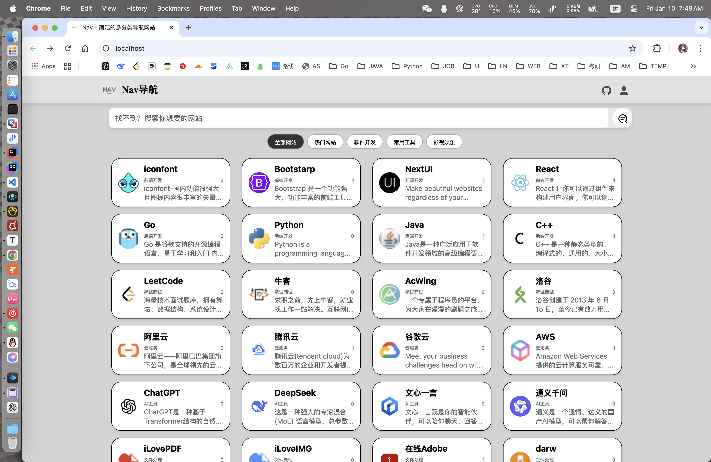

#### 顶部栏

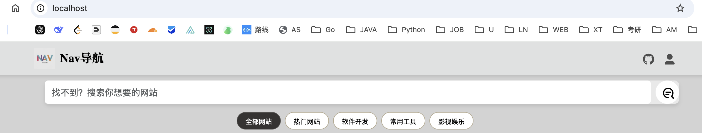

#### 搜索结果

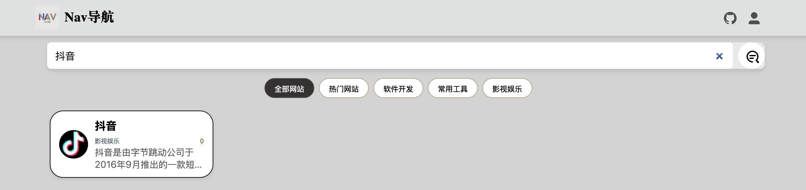

#### 二级菜单

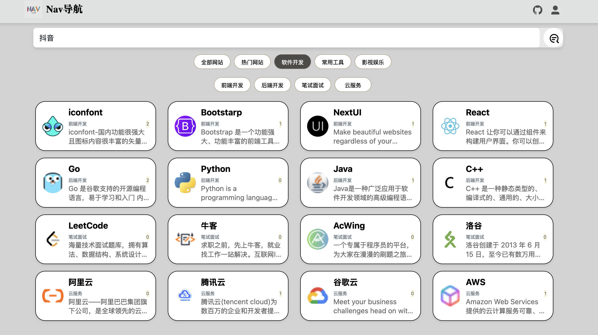

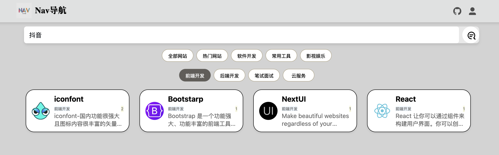

### 登录界面

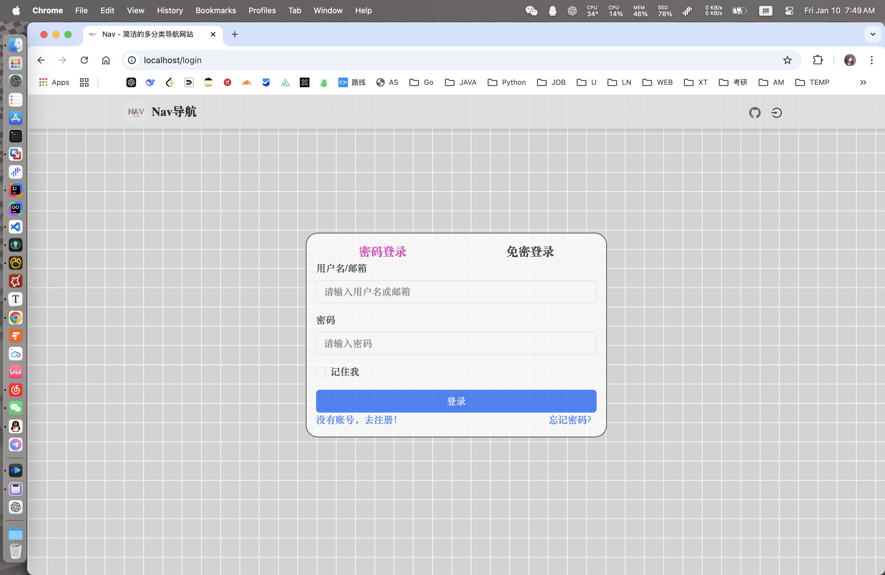

#### 注册


#### 免密登录

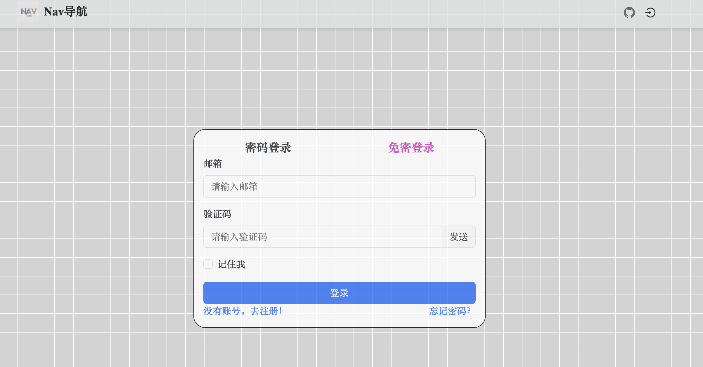

#### 忘记密码

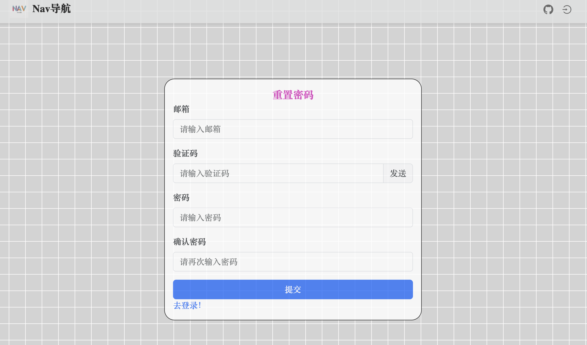

#### 登录结果

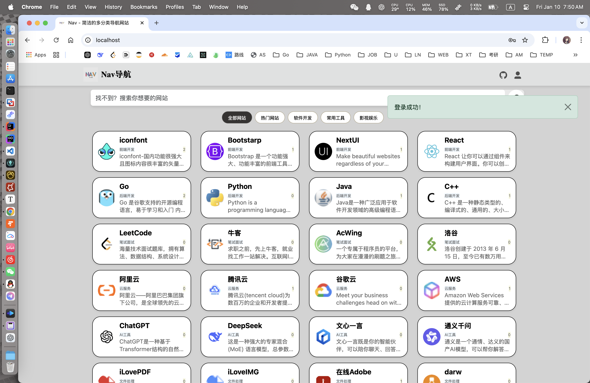

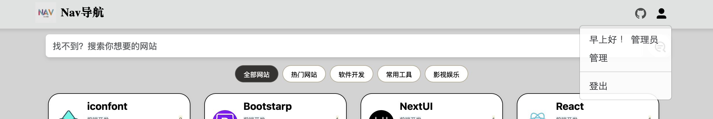

#### 验证码登录

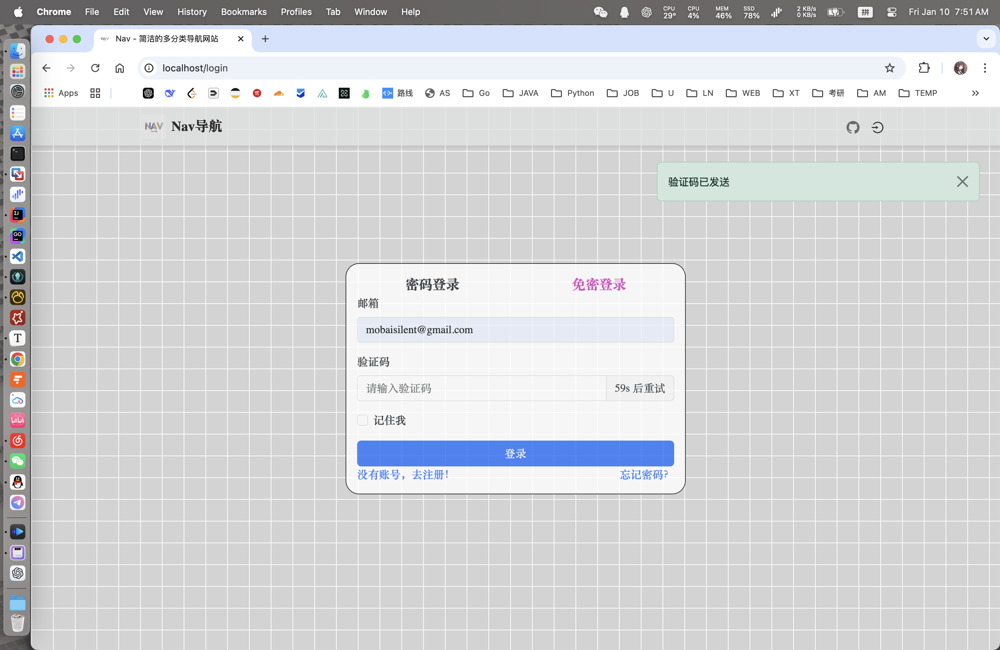

能够通过smtp服务发送验证码。

接受结果如下：


### 管理

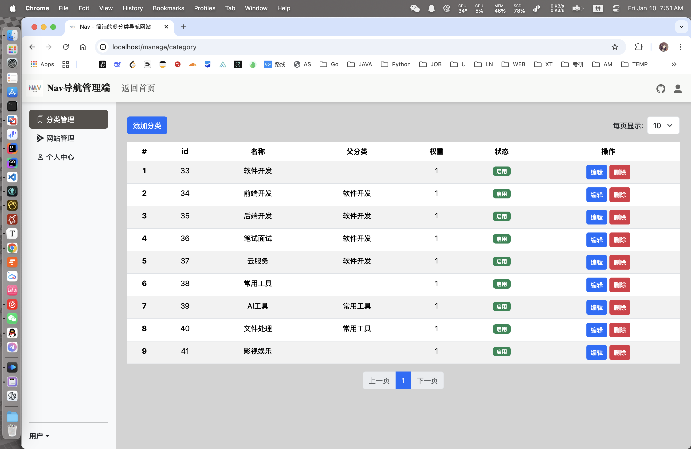

#### 添加分类

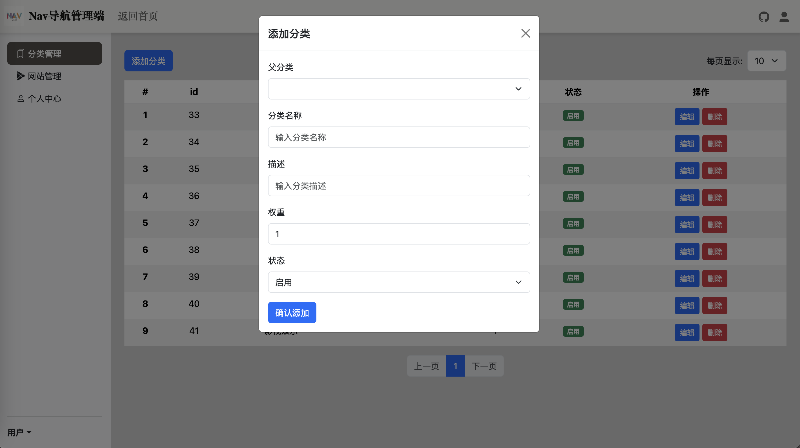

#### 添加网站

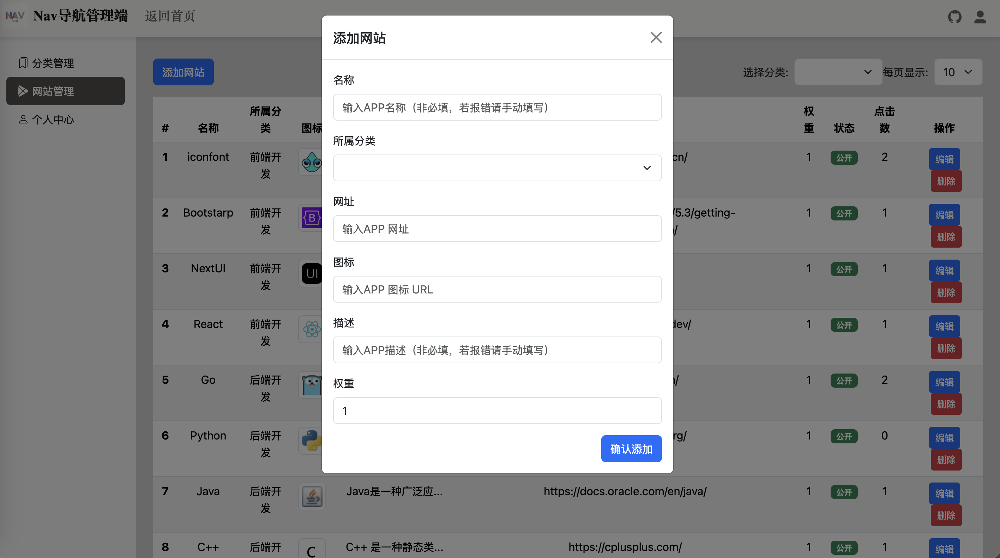

非必填项能够通过后端爬取（Callable工具类）

#### 个人信息

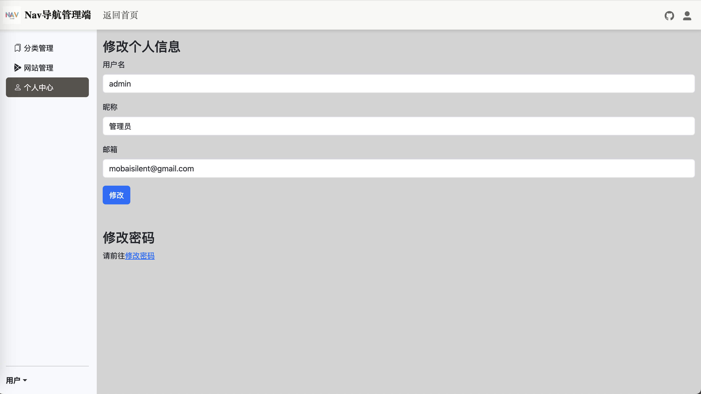

因为项目必须要将admin的导航信息公开展示，所以至少需要一个用户的username（用户名）为admin

### 非admin

其他用户的自定义分类

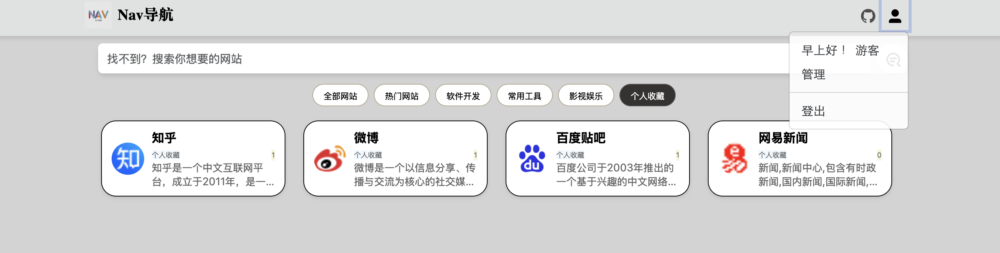

可见该游客能够添加自己的私人导航栏”个人收藏“。

## 项目逻辑

admin 用户的导航栏公开展示，为公众提供一个基本的导航栏功能。

其他用户登录之后能够添加自己想要的导航信息，实现个性化需求。
